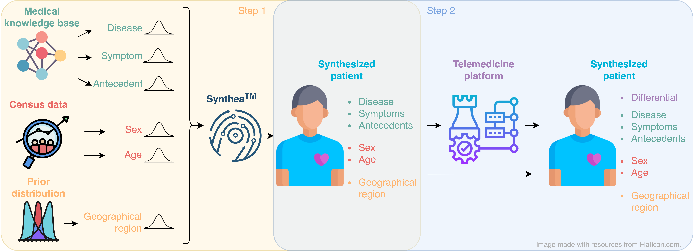
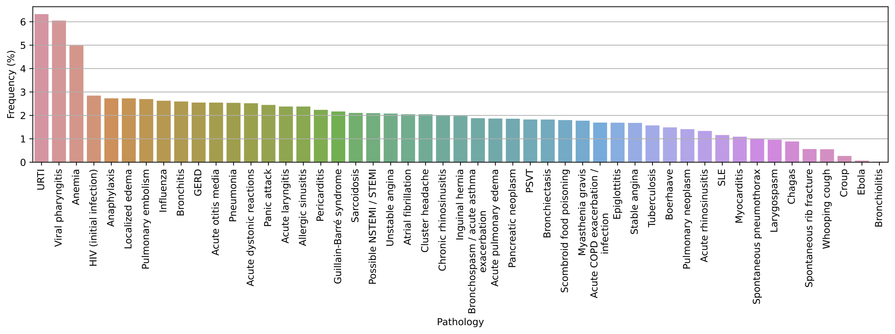
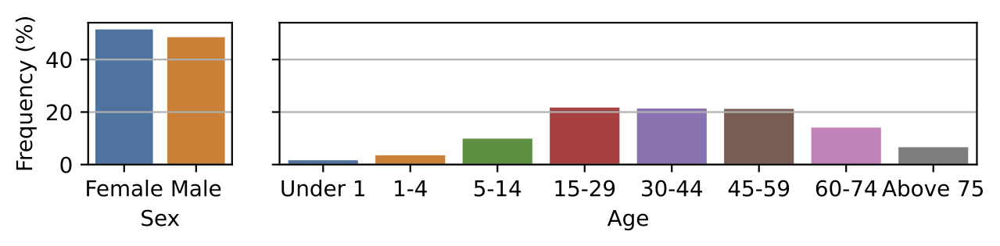
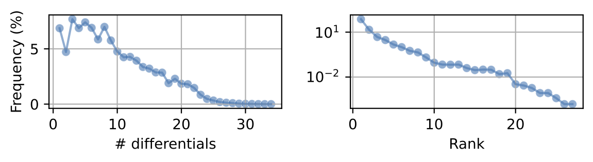

# DDXPlus: A New Dataset For Automatic Medical Diagnosis



*Appearing in NeurIPS 2022 dataset and benchmark track*

We are releasing under the CC-BY licence a new large-scale dataset for Automatic Symptom Detection (ASD) and Automatic Diagnosis (AD) systems in the medical domain. 

The dataset contains patients synthesized using a proprietary medical knowledge base and a commercial rule-based ASD system. Patients in the dataset are characterized by their socio-demographic data, a pathology they are suffering from, a set of symptoms and antecedents related to this pathology, and a differential diagnosis. The symptoms and antecedents can be binary, categorical and multi-choice, with the potential of leading to more efficient and natural interactions between ASD/AD systems and patients.  

To the best of our knowledge, this is the first large-scale dataset that includes the differential diagnosis, and non-binary symptoms and antecedents.

- [DDXPlus: A New Dataset For Automatic Medical Diagnosis](#ddxplus-a-new-dataset-for-automatic-medical-diagnosis)
  - [Availability](#availability)
  - [Dataset documentation](#dataset-documentation)
    - [Evidence description](#evidence-description)
      - [Example](#example)
    - [Pathology description](#pathology-description)
      - [Example](#example-1)
    - [Patient description](#patient-description)
      - [Example](#example-2)
  - [Dataset statistics](#dataset-statistics)
    - [Pathology statistics](#pathology-statistics)
    - [Socio-demographic statistics](#socio-demographic-statistics)
    - [Distribution of the evidence types](#distribution-of-the-evidence-types)
    - [Number of evidences of the synthesized patients](#number-of-evidences-of-the-synthesized-patients)
    - [Differential diagnosis statistics](#differential-diagnosis-statistics)
  - [Experiments](#experiments)

## Availability

- Our **paper** is available on [arXiv](https://arxiv.org/abs/2205.09148).
- The **dataset** in **French** is hosted on [figshare](https://figshare.com/articles/dataset/DDXPlus_Dataset/20043374).
  - This is the original version of DDXPlus that all results in our paper were obtained on.
- Starting from , the **dataset** is also available in **English** for easier use.
  - The English version of DDXPlus contains the same data in the same format as the French version.
  - Wherever possible, English names or non-semantic codes are used instead of French names.
  - Using the English version should lead to the same performance as using the French version.
<!-- #FIXME: check the date and add link-->

## Dataset documentation

In what follows, we use the term *evidence* as a general term to refer to a symptom or an antecedent. The dataset contains the following files:
- `release_evidences.json`: a JSON file describing all possible evidences considered in the dataset.
- `release_conditions.json`: a JSON file describing all pathologies considered in the dataset.
- `release_train_patients.zip`: a CSV file containing the patients of the training set.
- `release_validate_patients.zip`: a CSV file containing the patients of the validation set.
- `release_test_patients.zip`: a CSV file containing the patients of the test set.

### Evidence description
Each evidence in the `release_evidences.json` file is described using the following entries:

- `name`: name of the evidence.
  - In the English version, this is replaced with a unique, non-semantic code starting with `E`.
- `code_question`: a code allowing to identify which evidences are related. Evidences having the same `code_question` form a group of related symptoms. The value of the `code_question` refers to the evidence that need to be simulated/activated for the other members of the group to be eventually simulated.
- `question_fr`: the query, in French, associated to the evidence.
- `question_en`: the query, in English, associated to the evidence.
- `is_antecedent`: a flag indicating whether the evidence is an antecedent or a symptom.
- `data_type`: the type of the evidence. We use "B" for binary, "C" for categorical, and "M" for multi-choice.
- `default_value`: the default value of the evidence. If this value is used to characterize the evidence, then it is as if the evidence was not synthesized.
- `possible-values`: the possible values for the evidence. Only valid for categorical and multi-choice evidences.
  - In the English version, every value is replaced with a unique, non-semantic code starting with `V`.
- `value_meaning`: The meaning, in French and English, of each code that is part of the `possible-values` field. Only valid for categorical and multi-choice evidences.

#### Example

*English*

```json
{
    "name": "E_130",
    "code_question": "E_129",
    "question_fr": "De quelle couleur sont les lésions?",
    "question_en": "What color is the rash?",
    "is_antecedent": false,
    "default_value": "V_11",
    "value_meaning": {
        "V_11": {"fr": "NA", "en": "NA"},
        "V_86": {"fr": "foncée", "en": "dark"},
        "V_107": {"fr": "jaune", "en": "yellow"},
        "V_138": {"fr": "pâle", "en": "pale"},
        "V_156": {"fr": "rose", "en": "pink"},
        "V_157": {"fr": "rouge", "en": "red"}
    },
    "possible-values": [
        "V_11",
        "V_86",
        "V_107",
        "V_138",
        "V_156",
        "V_157"
    ],
    "data_type": "C"
}
```
*French*
```json
{
    "name": "lesions_peau_couleur",
    "code_question": "lesions_peau",
    "question_fr": "De quelle couleur sont les lésions?",
    "question_en": "What color is the rash?",
    "is_antecedent": false,
    "default_value": "NA",
    "value_meaning": {
        "NA": {"fr": "NA", "en": "NA"},
        "foncee": {"fr": "foncée", "en": "dark"},
        "jaune": {"fr": "jaune", "en": "yellow"},
        "pale": {"fr": "pâle", "en": "pale"},
        "rose": {"fr": "rose", "en": "pink"},
        "rouge": {"fr": "rouge","en": "red"}
    },
    "possible-values": [
        "NA",
        "foncee",
        "jaune",
        "pale",
        "rose",
        "rouge"
    ],
    "data_type": "C"
}
```

### Pathology description
The file `release_conditions.json` contains information about the pathologies patients in the datasets may suffer from. Each pathology has the following attributes:
- `condition_name`: name of the pathology.
  - In the English version, the English name is used instead of the French name.
- `cond-name-fr`: name of the pathology in French.
- `cond-name-eng`: name of the pathology in English.
- `icd10-id`: ICD-10 code of the pathology.
- `severity`: the severity associated with the pathology. The lower the more severe.
- `symptoms`: data structure describing the set of symptoms characterizing the pathology. Each symptom is represented by its corresponding `name` entry in the `release_evidences.json` file.
- `antecedents`: data structure describing the set of antecedents characterizing the pathology. Each antecedent is represented by its corresponding `name` entry in the  `release_evidences.json` file.


#### Example
*English*
```json
{
    "condition_name": "Myasthenia gravis",
    "cond-name-fr": "Myasthénie grave",
    "cond-name-eng": "Myasthenia gravis",
    "icd10-id": "G70.0",
    "symptoms": {
        "E_65": {},
        "E_63": {},
        "E_52": {},
        "E_172": {},
        "E_84": {},
        "E_66": {},
        "E_90": {},
        "E_38": {},
        "E_176": {}
     },
    "antecedents": {
        "E_28": {},
        "E_204": {}
    },
    "severity": 3
}
```
*French*
```json
{
    "condition_name": "Myasthénie grave",
    "cond-name-fr": "Myasthénie grave",
    "cond-name-eng": "Myasthenia gravis",
    "icd10-id": "G70.0",
    "symptoms": {
        "dysphagie": {},
        "dysarthrie": {},
        "diplopie": {},
        "ptose": {},
        "faiblesse_msmi": {},
        "dyspn": {},
        "fatigabilité_msk": {},
        "claud_mâchoire": {},
        "rds_paralys_gen": {}
    },
    "antecedents": {
        "atcdfam_mg": {},
        "trav1": {}
    },
    "severity": 3
}
```


### Patient description
Each patient in each of the 3 sets has the following attributes:
- `AGE`: the age of the synthesized patient.
- `SEX`: the sex of the synthesized patient.
- `PATHOLOGY`: name of the ground truth pathology (cf `condition_name` property in the `release_conditions.json` file) that the synthesized patient is suffering from.
- `EVIDENCES`: list of evidences experienced by the patient. An evidence can either be binary, categorical or  multi-choice. A categorical or multi-choice evidence is represented in the format `[evidence-name]_@_[evidence-value]` where [`evidence-name`] is the name of the evidence (`name` entry in the `release_evidences.json` file) and [`evidence-value`] is a value from the `possible-values` entry. Note that for a multi-choice evidence, it is possible to have several `[evidence-name]_@_[evidence-value]` items in the evidence list, with each item being associated with a different evidence value. A binary evidence is represented as `[evidence-name]`.
- `INITIAL_EVIDENCE`: the evidence provided by the patient to kick-start an interaction with an ASD/AD system. This is useful during model evaluation for a fair comparison of ASD/AD systems as they will all begin an interaction with a given patient from the same starting point. The initial evidence is randomly selected from the evidence list mentioned above (i.e., `EVIDENCES`) and it is part of this list.
- `DIFFERENTIAL_DIAGNOSIS`: The ground truth differential diagnosis for the patient. It is represented as a list of pairs of the form `[[patho_1, proba_1], [patho_2, proba_2], ...]` where `patho_i` is the pathology name (`condition_name` entry in the `release_conditions.json` file) and `proba_i` is its related probability.

#### Example
*English*
```json
{
    "AGE": 18,
    "DIFFERENTIAL_DIAGNOSIS": [["Bronchitis", 0.19171203430383882], ["Pneumonia", 0.17579340398940366], ["URTI", 0.1607809719801254], ["Bronchiectasis", 0.12429044460990353], ["Tuberculosis", 0.11367177304035844], ["Influenza", 0.11057936110639896], ["HIV (initial infection)", 0.07333003867293564], ["Chagas", 0.04984197229703562]],
    "SEX": "M",
    "PATHOLOGY": "URTI",
    "EVIDENCES": ["E_48", "E_50", "E_53", "E_54_@_V_161", "E_54_@_V_183", "E_55_@_V_89", "E_55_@_V_108", "E_55_@_V_167", "E_56_@_4", "E_57_@_V_123", "E_58_@_3", "E_59_@_3", "E_77", "E_79", "E_91", "E_97", "E_201", "E_204_@_V_10", "E_222"],
    "INITIAL_EVIDENCE": "E_91"
}
```
*French*
```json
{
    "AGE": 18, 
    "DIFFERENTIAL_DIAGNOSIS": [["Bronchite", 0.19171203430383882], ["Pneumonie", 0.17579340398940366],["IVRS ou virémie", 0.1607809719801254], ["Bronchiectasies", 0.12429044460990353], ["Tuberculose", 0.11367177304035844], ["Possible influenza ou syndrome virémique typique", 0.11057936110639896], ["VIH (Primo-infection)", 0.07333003867293564], ["Chagas", 0.04984197229703562]], 
    "SEX": "M", 
    "PATHOLOGY": "IVRS ou virémie", 
    "EVIDENCES": ["crowd", "diaph", "douleurxx", "douleurxx_carac_@_sensible", "douleurxx_carac_@_une_lourdeur_ou_serrement", "douleurxx_endroitducorps_@_front", "douleurxx_endroitducorps_@_joue_D_", "douleurxx_endroitducorps_@_tempe_G_", "douleurxx_intens_@_4", "douleurxx_irrad_@_nulle_part", "douleurxx_precis_@_3", "douleurxx_soudain_@_3", "expecto", "f17.210", "fievre", "gorge_dlr", "toux", "trav1_@_N", "z77.22"], 
    "INITIAL_EVIDENCE": "fievre"
}
```

## Dataset statistics

### Pathology statistics

<!--  -->


### Socio-demographic statistics

<!--  -->


### Distribution of the evidence types

|                 | Binary | Categorical | Multi-choice | Total |
|:---------------:|:------:|:-----------:|:------------:|:-----:|
|  **Evidences**  |   208  |      10     |       5      |  223  |
|   **Symptoms**  |   96   |      9      |       5      |  110  |
| **Antecedents** |   112  |      1      |       0      |  113  |

### Number of evidences of the synthesized patients

|                 |  Avg  | Std dev | Min | 1st quartile | Median | 3rd quartile | Max |
|:---------------:|:-----:|:-------:|:---:|:------------:|:------:|:------------:|:---:|
|  **Evidences**  | 13.56 |   5.06  |  1  |      10      |   13   |      17      |  36 |
|   **Symptoms**  | 10.07 |   4.69  |  1  |       8      |   10   |      12      |  25 |
| **Antecedents** |  3.49 |   2.23  |  0  |       2      |    3   |       5      |  12 |'

### Differential diagnosis statistics



## Experiments

Code for reproducing results in the paper can be found in [`code`](code).

In our paper, we reported results of two methods, a RL-based method [AARLC](https://arxiv.org/abs/2112.00733) and a supervised method BASD which is adapted from [ASD](https://arxiv.org/abs/2101.09773). For instructions on how to run them, see [here](code/aarlc/readme.md) for AARLC and [here](code/basd/readme.md) for BASD.
